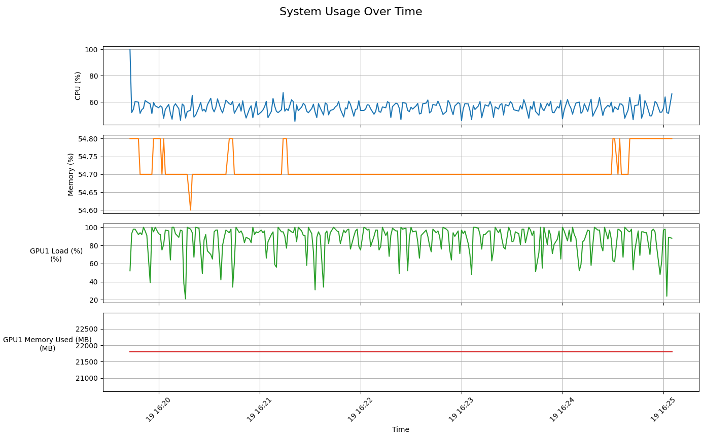

## CPU、GPU、内存监控

### 1. 环境安装
```bash
pip install psutil gputil matplotlib pandas -i https://pypi.mirrors.ustc.edu.cn/simple/
```
| 库名        | 用途说明 |
|-------------|----------|
| `psutil`    | 获取系统信息（CPU、内存等） |
| `GPUtil`    | 获取 NVIDIA GPU 状态（显存、负载等） |

**⚠️ 注意事项**

- **GPU 监控仅适用于 NVIDIA 显卡**，并需安装 [NVIDIA 驱动](https://www.nvidia.com/Download/index.aspx) 和 `nvidia-smi` 命令。
- 如果你使用的是 AMD 或 Intel 显卡，`GPUtil` 可能无法获取 GPU 数据，但不影响 CPU 和内存监控。

### 2. 监控脚本
**显卡数量在`num_gpus`参数设置**
```bash
$ python monitor_to_csv.py
[2025-06-19 16:24:18] CPU: 49.2%, MEM: 54.7%, GPU1: Load=80.0%, Mem=21799.0 MB, GPU2: Load=67.0%, Mem=20253.0 MB, GPU3: Load=79.0%, Mem=20147.0 MB, GPU4: Load=82.0%, Mem=19795.0 MB, GPU5: Load=0.0%, Mem=18.0 MB, GPU6: Load=0.0%, Mem=18.0 MB, GPU7: Load=0.0%, Mem=18.0 MB, GPU8: Load=0.0%, Mem=18.0 MB
```
### 3. 绘图脚本
```bash
python plot_from_csv.py
```
**📊 结果**


